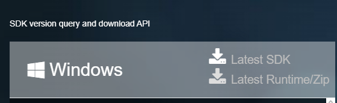

# RPG-Master

## environment _WIN32
create file named "external_library"

### inside put:
#### glfw-3.4.bin.WIN64

https://www.glfw.org/download.html
\
binaries

#### glm-1.0.1-light
https://github.com/g-truc/glm/releases
\
download, glm-1.0.1-light.zip, extract at "external_library" file

#### VulkanSKD-1.3.283.0
https://vulkan.lunarg.com/sdk/home \
 \
click on: Latest SDK
\
you will only need "Include" and "Lib" files here

#### SLFW
pacman -S mingw-w64-x86_64-sfml \
and dependencies: https://packages.msys2.org/package/mingw-w64-x86_64-sfml
## Linux

### libraries:

#### glfw:
sudo apt-get install libglfw3 
\
sudo apt-get install libglfw3-dev

#### vulkan:
follow the tutorial \
https://vulkan.lunarg.com/doc/sdk/1.3.283.0/linux/getting_started_ubuntu.html

#### glm:
for glm-1.0.1-light:
\
create file named "external_library"
https://github.com/g-truc/glm/releases
\
download, glm-1.0.1-light.zip, extract at "external_library" file

# References
11/05/2024-19:30- <https://youtu.be/tRQ3zqCiKdQ?si=O_j0H0RX7W6pZlHY> \
23/05/2024-20:43- <https://youtu.be/uO__ntYT-2Q?si=k2ZWw_2jLggLMlld> \
25/05/2024-09:23- <https://youtu.be/JxXU2kgmef4?si=-bEaO4G9MLPvxhTK> \
25/05/2024-10:32- <https://youtu.be/d2jkALhm9EE?si=vcYHzwbtNGsU2EqS> \
28/05/2024-22:00- <https://www.programiz.com/cpp-programming/list>

